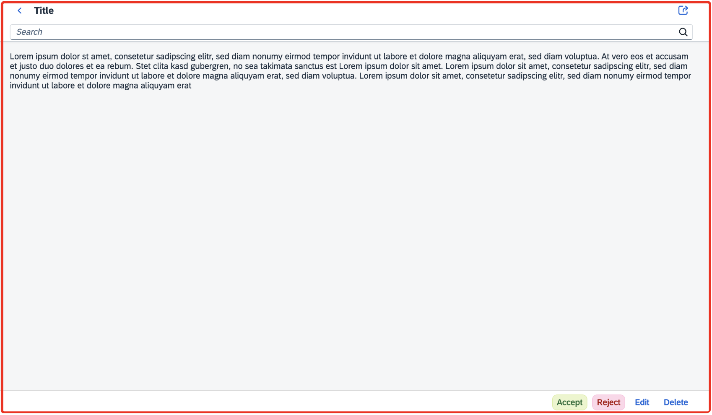

# Step11 : Pages and Panels

  

## **Page** : 전체화면을 나타내는 컨트롤

## **Panel** : 헤더와 컨텐츠 영역을 가지고 있는 컨트롤

  

Page는 다음과 같이 헤더/컨텐츠/푸터등으로 이루어진 전체화면으로 표시되다.

  

  

  

Panel은 다음과 같이 표시된다.

  

  

  

# 실습

### 1\. 모든 컨트롤의 root 태그인 <App>을 다음과 같이 root 뷰에 입력한다.

  

  

  

### 2\. sap.m.App 모듈은 pages라는 aggregation을 가지고 있으며, 해당 aggregation 안에는 여러개의 Page 컨트롤이 들어갈수 있다. 현재 Page는 하나만 필요하므로 다음과 같이 <Page>컨트롤을 입력한다.

  

  

  

### 3\. Page는 content라는 aggregation을 가지고 있으며 해당 부분에 Panel을 추가한다.

  

  

  

### 4\. Page에 타이틀을 다음과 같이 추가한다.

  

  

  

i18n 파일 (i18n.properties)에 텍스트를 등록한다.

  

  

  

다음과 같이 Page의 제목에 출력이 된다.

  

  

  

  

### 5\. Panel에 타이틀을 추가하고 i18n 모델에 타이틀의 텍스트를 추가한다.

  

  

  

  

  

다음과 같이 Panel의 헤더 텍스트가 출력이 된다.

  

