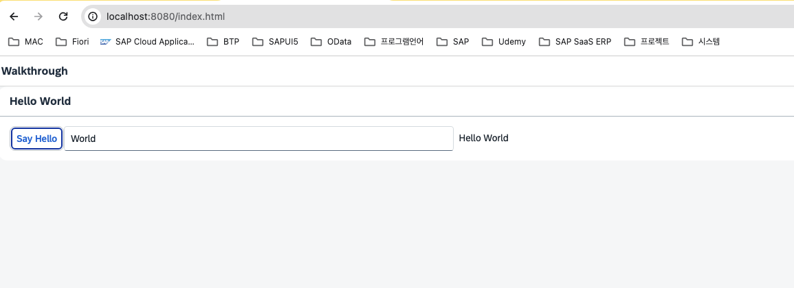

# 20240531-11-Step12 : Shell Control as Container

  

## **Shell** : 앱을 둘러싸는 컨드롤로 앱을 출력하는 디바이스에 따라서 특정 크기로 앱을 조절해 주는 역할

##   

기본적으로 Fiori Launchpad등에는 해당 컨트롤이 기본적으로 적용이 되어 있기 때문에, 이러한 환경에서 사용하는 경우에는 Shell로 화면을 감쌀 필요가 없다.

  

  

# 실습

### 1\. 다음은 기존에 Shell이 깜싸지지 않은 화면이다.

  

  

  

#### 2\. 먼저 최상위 UI 컨트롤인 App을 Shell 컨트롤로 감싼다.

  

  

```
<mvc:View controllerName="ui5.walkthrough.controller.App"
   xmlns="sap.m"
   xmlns:mvc="sap.ui.core.mvc"
   displayBlock="true">
   <Shell>
      <App>
         <pages>
            <Page title="{i18n>homePageTitle}">
               <content>
                  <Panel headerText="{i18n>helloPanelTitle}">
                     <content>
                        <Button text="{i18n>showHelloButtonText}"
                           press=".onShowHello"/>
                        <Input value="{/recipient/name}"
                           description="Hello {/recipient/name}"
                           valueLiveUpdate="true"
                           width="60%"/>
                     </content>
                  </Panel>
               </content>
            </Page>
         </pages>
      </App>
   </Shell>
</mvc:View> 
```

  

### 3\. 다시 화면을 실행해 보면 다음과 같이 특정 크기의 화면으로 감싸진걸 화면을 볼수 잇다.

  
  

  

###