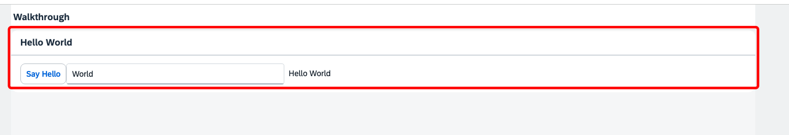

# 20240531-11-Step13 : Margins and Padding

  

## **Margins** : 컨트롤과 컨트롤 사이의 간격

## **Paddings** : 컨트롤의 외부경계선과 안의 컨텐츠 (텍스트 등등)의 간격

  

**관련 URL** 

- Margins : [https://ui5.sap.com/#/topic/777168ffe8324873973151dae2356d1c](https://ui5.sap.com/#/topic/777168ffe8324873973151dae2356d1c)
- Paddings : [https://ui5.sap.com/#/topic/c71f6df62dae47ca8284310a6f5fc80a](https://ui5.sap.com/#/topic/c71f6df62dae47ca8284310a6f5fc80a)

  

# 실습

  

### 1\. 먼저 기존 Margins이 추가되지 않은 화면을 실행해 본다.

  

  

  

### 2\. Margins을 다음과 같이 추가한다.

```
<mvc:View controllerName="ui5.walkthrough.controller.App"
   xmlns="sap.m"
   xmlns:mvc="sap.ui.core.mvc"
   displayBlock="true">
   <App>
      <pages>
         <Page title="{i18n>homePageTitle}">
            <content>
               <Panel headerText="{i18n>helloPanelTitle}"
                  class="sapUiResponsiveMargin">
                  <content>
                     <Button text="{i18n>showHelloButtonText}"
                        press=".onShowHello"/>
                     <Input value="{/recipient/name}"
                        description="Hello {/recipient/name}"
                        valueLiveUpdate="true"
                        width="60%"/>
                  </content>
               </Panel>
            </content>
         </Page>
      </pages>
   </App>
</mvc:View>
```

  

### 3\. 결과 화면을 보면 다음과 같이 Margin이 추가가 됨을 알 수 있다.

  

  

### 4\. Say Hello 버튼과 Input 필드사이에 공간이 없으므로 여기에 마진을 다음과 같이 넣어서 결과화면을 확인하면 다음과 같다.

  

결과화면은 다음과 같다.

  

  

###
