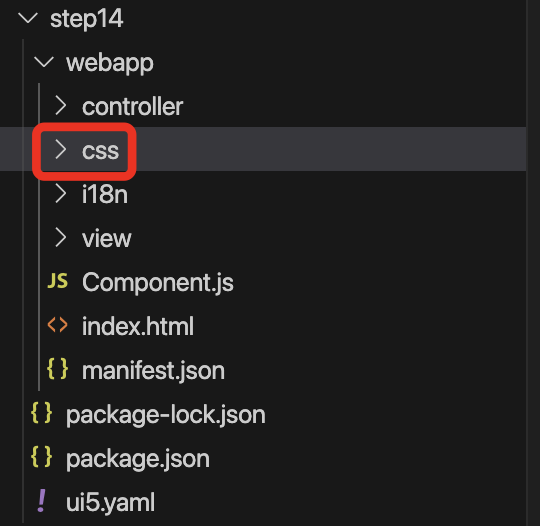

# 20240606-11-Step14 : Custom CSS

  

## **Custom CSS** : 컨트롤의 레이아웃을 좀 더 세밀하게 사용자가 정의하고자 하는 경우에 사용   

  

### **주의**

- SAPUI5가 제공하지 않는 CSS를 사용하는 경우에 UI5가 업그레이드가 되는 경우에 CUSTOM CSS를 적용한 항목에 대해서 반드시 문제가 없는지 확인이 필요하다.
- 최대한 custom css를 사용하는 것은 지양해야 한다.

  

# 실습

  

### 1\. 먼저 CSS파일을 작성하기 위해서 css 폴더를 UI5앱 루트폴더 (webapp)에 생성한다.

  

  

### 2\. css 폴더 밑에 css파일을 생성한다. 여기서는 “style.css”롤 생성한다.

  

  

### 3\. css 파일을 UI5에 적용하기 위해서 설정파일 manifest.json 파일에 다음과 같이 수정을 한다.

  

  

### 4\. 해당 UI5앱에 대해서 적용되는 CSS를 만들기 위해서 별다른 의미는 없지만 App 컨트롤에 class를 하나 추가한다. 해당 클래스 명을 가지고 css 파일을 설정하는 시작점으로 사용하게 된다.

  

  

### 5\. css를 적용할 컨트롤에 class를 추가한다. 여기서는 기존에 적용한 Button의 SAP 표준 클래스 대신에 Custom CSS로 마진을 넣기 위해서 Button에 class를 다음과 같이 적용한다.

  

  

### 6\. 다음과 같이 Custom CSS가 적용되기 전과 적용되는 코드 적용된 후의 화면을 확인한다.

  

  

css 파일을 다음과 같이 작성한다. 보다 구체적으로 Button컨트롤의 표준 클래스인 sapMBtn에 적용해야 한다.

```
.fiori00 .myCustomButton.sapMBtn {
  margin-right: 0.3rem
}
```

  

결과 화면은 다음과 같다.

  

  

### 7\. 다음으로 파란색으로 화면에 텍스트를 표시하기 위해서 FormattedText 컨트롤을 이용해서 출력하는 절차는 다음과 같다.

  

먼저 View에 FormattedText를 추가하면서 텍스트를 모델의 /recepient/name 패스의 정보를 바이딩 한다.

  

다음과 같이 일반적인 텍스트가 출력이된다.

  

  

다음으로 해당 텍스트를 파란색으로 하기 위해서 다음과 같이 class를 추가하고 css를 수정한다.

  

```
.fiori00 .myCustomButton.sapMBtn {
  margin-right: 0.3rem
}

.fiori00 .myCustomText {
  display: inline-block;
  font-weight: bold;
}
```

  

  

  

  

  

###